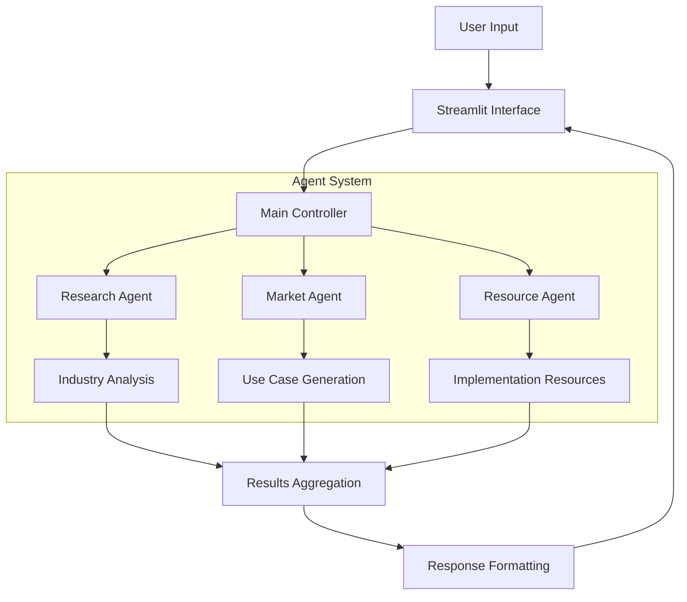

# Market Research System Architecture

## System Overview

The Market Research System is a multi-agent AI system designed to analyze industries, generate AI/ML use cases, and provide implementation resources. The system consists of three specialized agents working together through a streamlined interface, along with a utility for enhanced web searching.

## Directory Structure

```
market_research_system/
├── src/
│   ├── agents/
│   │   ├── __init__.py        
│   │   ├── base.py           # Base agent class with common functionality
│   │   ├── research_agent.py # Industry analysis agent
│   │   ├── market_agent.py   # Use case generation agent
│   │   └── resource_agent.py # Implementation resources agent
│   ├── utils/
│   │   ├── __init__.py        
│   │   ├── web_search.py     # Web search utilities
│   ├── config/
│   │   ├── __init__.py        
│   │   └── constants.py      # System configuration
│   └── interface/
│   │   ├── __init__.py        
│       └── streamlit_app.py   # Web interface
│── __init__.py
│── main.py
│── models.py
│── run.py 
```

## System Flow



## Implementation Details

### Base Agent
```python
class BaseAgent:
    def __init__(self):
        self.llm = self._init_llm()
        self.tools = self._setup_tools()
        self.memory = self._setup_memory()
        
    def get_response(self, prompt: str) -> str:
        """Get response from agent without cost tracking."""
        try:
            response = self.agent_executor.invoke({"input": prompt})
            return response["output"] if isinstance(response, dict) else str(response)
        except Exception as e:
            error_msg = f"Error getting response: {e}"
            print(error_msg)
            return error_msg
```

### Web Search Tool
```python
class WebSearchTool:
    """Enhanced web search utility with result processing."""
    
    def search_with_metadata(self, query: str, num_results: int = 5) -> List[Dict]:
        """Perform a web search and return structured results with metadata."""
        # ...
```

### Agent Specialization
```python
class ResearchAgent(BaseAgent):
    """Industry analysis specialization"""
    
class MarketAgent(BaseAgent):
    """Use case generation specialization"""
    
class ResourceAgent(BaseAgent):
    """Implementation resources specialization"""
``` 